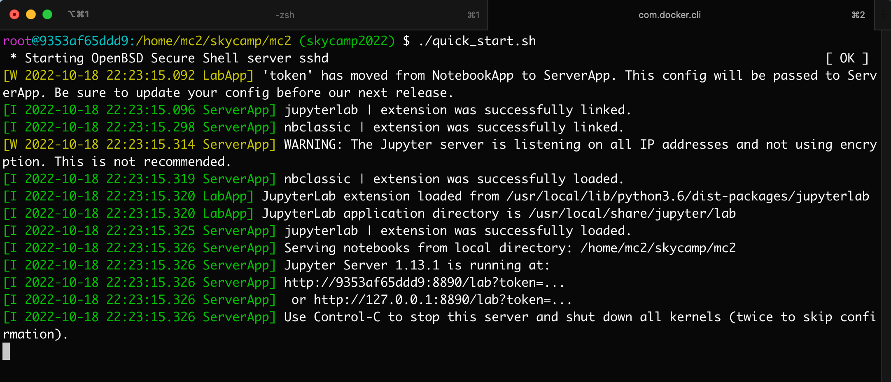

# Sky Camp 2022

Welcome to the MC<sup>2</sup> tutorial for Sky Camp 2021. MC<sup>2</sup> is a platform for secure collaborative computation. In particular, for this tutorial we present [Secure XGBoost](https://github.com/mc2-project/secure-xgboost), a library for secure collaborative gradient boosted decision tree learning. In this tutorial, you'll collaborate with others to load encrypted data, train a model, and serve encrypted predictions. Below are instructions on how to set up and run the tutorial.

## Participant Instructions

1. **Install Docker Desktop (Mac + Windows) or Docker Engine (version 20.10.8 or above).** Find installation instructions for your platform here: https://docs.docker.com/get-docker/

1. **Verify that Docker has been installed correctly and is running**
    
    Run `docker version` and you should see output that lists version numbers for Docker Engine. If you do not see this or if the command `docker` is not found, then you may need to reinstall Docker or add Docker to your system path.
    
    **(Mac + Windows)** After starting Docker Desktop, run `docker ps` in your terminal and expect non-error output to verify that Docker is running.
    
    **(Linux)** Run `docker ps` to confirm that Docker us running. If not, then run `sudo service docker start` to start Docker.


1. **Pull and run the docker image for the tutorial**
    
    View the image on Dockerhub [here](https://hub.docker.com/repository/docker/mc2project/skycamp2022/general)
    
    *Note that the image size is ~3.4gb, so make sure to have at least this much storage space available on your machine before running the below commands.*
    

```bash
# This command pulls the tutorial image from Dockerhub
docker pull mc2project/skycamp2022:v1

# This command is running docker with port binding on port 8890
# This is necessary for accessing the tutorial notebook in your local browser
# The `/home/mc2/skycamp/mc2/quick_start.sh` script contains commands to:
#  1. Start the ssh service on Linux (needed for tutorial)
#  2. Start a jupyter notebook on port 8890
docker run -p 8890:8890 -it mc2project/skycamp2022:v1 /home/mc2/skycamp/mc2/quick_start.sh
```

4. **You should see output similar to the following if the Jupyter notebook has started successfully**



5. **Navigate to [http://localhost:8890](http://localhost:8890) or [http://127.0.0.1:8890](http://127.0.0.1:8890) to view the Jupyter notebook interface and enter the password `SkyCamp2022` to access the Jupyter Lab environment.


Click on `Welcome - Start Here.ipynb` in the left-hand file viewer to start the tutorial!**


6. **Leave feedback for the Sky Camp MC2 tutorial [here](https://forms.gle/mRZNqMHa9Xgcrg9F6) 🙏**
